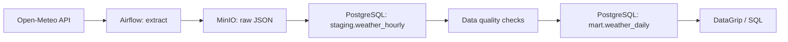

# Weather Data Pipeline

[](https://github.com/WhySatanic/weather-data-pipeline/actions/workflows/ci.yml)

An automated ELT pipeline that collects hourly weather forecasts from Open-Meteo, keeps raw API responses in MinIO, validates and models the data in PostgreSQL, and runs daily with Apache Airflow.

## Architecture



## Data layers

| Layer | Object | Purpose |
|---|---|---|
| Raw | MinIO `weather-raw` | Immutable API responses partitioned by extraction date |
| Staging | `staging.weather_hourly` | Idempotent hourly weather records |
| Mart | `mart.weather_daily` | Daily city-level analytical data mart |

The DAG runs at `06:00 Europe/Moscow`. It fetches Moscow, Saint Petersburg, and Kazan. Re-running a date updates existing hourly records instead of duplicating them.

## Run locally

```powershell
Copy-Item .env.example .env
docker-compose up --build -d
```

Services:

| Service | URL / connection |
|---|---|
| Airflow | http://localhost:8080 (`admin` / `admin`) |
| MinIO | http://localhost:9001 |
| PostgreSQL | `localhost:5433`, database `weather_dwh` |

Start `weather_daily_pipeline` in Airflow to run it immediately.

## DataGrip connection

| Field | Value |
|---|---|
| Host | `localhost` |
| Port | `5433` |
| Database | `weather_dwh` |
| User | `weather` |
| Password | `weather` |

Example query:

```sql
SELECT *
FROM mart.weather_daily
ORDER BY weather_date DESC, location_name;
```

Additional analytical queries are available in [`sql/reports/weather_insights.sql`](sql/reports/weather_insights.sql).

## Quality checks

The pipeline fails before mart refresh when it finds duplicate hourly records, incomplete city-days, negative precipitation or wind speed, or temperatures outside `-90..70°C`.

## Development

```powershell
docker-compose exec -T airflow-scheduler ruff check .
docker-compose exec -T airflow-scheduler pytest
```

GitHub Actions runs the same linting and test suite on every push and pull request.
